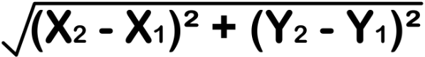

# Data Structures and Algorithms

<a name="Contents"></a>
## Table of contents
1. [Reader class](#ReaderClass)
2. [Sieve of eratosthenes](#SieveOfErast)
3. [Properties of a square](#CheckIfSquare)
4. [Finding single element in array of pairs](#FindSingle)
5. [Arrays](#Arrays)
    - [Basic Concepts](#Arrays_BasicConcepts)
    - [Bubble Sort](#Arrays_BubbleSort)
    - [Selection Sort](#Arrays_SelectionSort)
    - [Insertion Sort](#Arrays_InsertionSort)
    - [Merge Sort](#Arrays_MergeSort)
    - [Binary Search](#Arrays_BinarySearch)
    - [Kadane's Algorithm (Maximum sum contigous sub array)](#Arrays_KadanesAlgo)
    - [Merge two sorted arrays in O(1) extra space](#Arrays_MergeTwo)
	- [In place operations](#Arrays_InPlace)
6. [Faster printing using String Builder]

<a name="ReaderClass"></a>
## Reader Class for Java
```java
import java.io.*;
import java.lang.*;
import java.util.*;
class Reader
{
    static BufferedReader reader;
    static StringTokenizer tokenizer;
    
    static void init(InputStream input)
    {
        reader = new BufferedReader(new InputStreamReader(input));
        tokenizer = new StringTokenizer("");
    }
    
    static String next() throws IOException
    {
        while(!tokenizer.hasMoreTokens())
        {
            tokenizer = new StringTokenizer(reader.readLine());
        }
        return tokenizer.nextToken();
    }
    
    static int nextInt() throws IOException
    {
        return Integer.parseInt(next());
    }
    
    static long nextLong() throws IOException
    {
        return Long.parseLong(next());
    }
    
    static double nextDouble() throws IOException
    {
        return Double.parseDouble(next());
    }
}
```
<a href="#Contents">Back to contents</a>

<a name="SieveOfErast"></a>
## Sieve of Erastothenes (Find prime numbers upto a given number)
Sieve of Erastothenes is used to find prime numbers upto a given number N. The time complexity is O(N*log(log(N))).
```java
void sieveOfEratosthenes(int n)
{
    boolean prime[] = new boolean[n+1];
    for(int i=0;i<n;i++) 
    {
        prime[i] = true;
    }
    for(int p = 2; p*p <=n; p++) 
    {
        if(prime[p] == true) 
        {
            for(int i = p*p; i <= n; i += p) 
            {
                prime[i] = false; 
            } 
        }
    }
}
```
<a href="#Contents">Back to contents</a>

<a name="CheckIfSquare"></a>
## Properties of a Square
- All sides of a square are equal in length say, a.
- The length of the diagonal of a square is sqrt(2)*a.
- The distance between two points is 

<a href="#Contents">Back to contents</a>

<a name="FindSingle"></a>
## Find single element in an arrray where every other element comes twice
- Use the XOR property of bit manipulation.
- a XOR a = 0
- 0 XOR a = a
```java
int check(int[] nums)
{
    int a = 0;
    for(int i = 0; i < nums.length; i++)
    {
        a ^= nums[i];
    }
    return a;
}
```
<a href="#Contents">Back to contents</a>

<a name="Arrays"></a>
## Arrays
<a name="Arrays_BasicConcepts"></a>
### Basic Concepts
- Lookup : O(1)
- Update : O(1)
```java
ArrayList<Integer> arr = new ArrayList<Integer>(); //Empty size
ArrayList<Integer> arr = new ArrayList<Integer>(10); //10 size
arr.get(i); //Get value at index i in O(1)
arr.set(i, value); //Set value at index i in O(1)
arr.size(); //Get array size in O(1)
arr.add(value); //Add value at end of array in O(1)
arr.add(i, value); //Add value at index i in O(size - i)
```
<a href="#Contents">Back to contents</a>
<a name="Arrays_BubbleSort"></a>
### Bubble Sort
- Best Case : O(n)
- Average Case : O(n^2)
- Worst Case : O(n^2)
- Number of comparisons(Best case) : n-1
- Number of comparisons(Worst case) : (n-1)(n)/2
- Space complexity : O(1)
```java
public int[] BubbleSort(int[] a)
{
    int temp = 0;
    int n = a.length;
    for(int i = 0; i < n - 1; i++)
    {
        boolean flag = false;
        for(int j = 1; j < n; j++)
        {
            if(a[j-1] > a[j])
            {
                temp = a[j-1];
                a[j-1] = a[j];
                a[j] = temp;
                flag = true;
            }
        }
        if(!flag)
        {
            break;
        }
    }
    return a;
}
```
<a href="#Contents">Back to contents</a>
<a name="Arrays_SelectionSort"></a>
### Selection Sort
- Best Case : O(n)
- Average Case : O(n^2)
- Worst Case : O(n^2)
- Number of comparisons(Best case) : (n-1)(n)/2
- Number of comparisons(Worst case) : (n-1)(n)/2
- Space complexity : O(1)
```java
public int[] SelectionSort(int[] a)
{
    int n = a.length;
    for(int i = 0; i < n- 1; i++)
    {
        int min_ind = i;
        int min = a[i];
        for(int j = i + 1; j < n; j++)
        {
            if(a[j] < min)
            {
                min = a[j];
                min_ind = j;
            }
        }
        int temp = a[min_ind];
        a[min_ind] = a[i];
        a[i] = temp;
    }
    return a;
}
```
<a href="#Contents">Back to contents</a>
<a name="Arrays_InsertionSort"></a>
### Insertion Sort
- Best Case : O(n)
- Average Case : O(n^2)
- Worst Case : O(n^2)
- Number of comparisons(Best case) : (n-1)(n)/2
- Number of comparisons(Worst case) : (n-1)(n)/2
- Space complexity : O(1)
```java
public int[] InsertionSort(int[] arr)
{
    int n = arr.length;
    for (int i = 1; i < n; i++)
    {
        int key = arr[i];
        int j = i - 1;
        while (j >= 0 && arr[j] > key)
        {
            arr[j+1] = arr[j];
            j = j-1;
        }
        arr[j+1] = key;
    }
    return arr;
}
```
<a href="#Contents">Back to contents</a>
<a name="Arrays_MergeSort"></a>
### Merge Sort
- Best Case : O(nlog(n))
- Average Case : O(nlog(n))
- Worst Case : O(nlog(n))
- Number of comparisons(Best case) : nlogn(n)
- Number of comparisons(Worst case) : nlogn(n)
- Space complexity : O(n)
```java
public void MergeSort(int[] arr, int start, int end)
{
    if(start>end)
    {
        int mid = (start + end)/2;
        MergeSort(arr, start, mid);
        MergeSort(arr, mid + 1, end);
        Merge(arr, start, mid, end);
    }
}

public Merge(int[] arr, int start, int mid, int end)
{
    int[] temp = new int[end - start + 1];
    int i = start;
    int j = mid + 1;
    int k = 0;
    while(i <= mid && j <= end)
    {
        if(arr[i] <= arr[j])
        {
            temp[k] = arr[i];
            k++;
            i++;
        }
        else
        {
            temp[k] = arr[j];
            k++;
            j++;
        }
    }
    
    while(i <= mid)
    {
        temp[k] = arr[i];
        k++;
        i++;
    }
    
    
    while(j <= end)
    {
        temp[k] = arr[i];
        k++;
        i++;
    }
    
    for(int m = start; m <= end; m++)
    {
        arr[m] = temp[m-start];
    }
}
```
<a href="#Contents">Back to contents</a>
<a name="Arrays_BinarySearch"></a>
### Binary Search
- Best Case : O(1)
- Average Case : O(log(n))
- Worst Case : O(log(n))
- Space complexity : O(1)
```java
public int BinarySearch(int[] arr, int start, int end, int value)
{
    if (start > end)
    {
        return -1;
    }
    int mid = (start + end) / 2;
    if (arr[mid] == value)
    {
        return mid;
    }
    else if (arr[mid] > value)
    {
        return BinarySearch(arr, start, mid - 1, value);
    }
    else
    {
        return BinarySearch(arr, mid + 1, end, value);
    }
}
```
<a href="#Contents">Back to contents</a>
<a name="Arrays_KadanesAlgo"></a>
### Kadane's Algorithm
<a href="#Contents">Back to contents</a>
<a name="Arrays_MergeTwo"></a>
### Merge two sorted arrays in O(1) extra space
```java
public void merge(int[] arr1, int[] arr2)
{
    StringBuilder sbf = new StringBuilder();
    int gap = n + m;
    gap = (int) Math.ceil(((double) gap) / 2);
    while (gap >= 1)
    {
        for (int i = 0; i + gap < n + m; i++)
        {
            if (i < n)
            {
                if (i + gap < n)
                {
                    if (arr1[i] > arr1[i + gap])
                    {
                        int temp = arr1[i];
                        arr1[i] = arr1[i + gap];
                        arr1[i + gap] = temp;
                    }
                }
                else
                {
                    if (arr1[i] > arr2[(i + gap) - n])
                    {
                        int temp = arr1[i];
                        arr1[i] = arr2[(i + gap) - n];
                        arr2[(i + gap) - n] = temp;
                    }
                }
            }
            else
            {
                if (arr2[i - n] > arr2[(i + gap) - n])
                {
                    int temp = arr2[i - n];
                    arr2[i - n] = arr2[(i + gap) - n];
                    arr2[(i + gap) - n] = temp;
                }
            }
        }
        if (gap == 1)
        {
            break;
        }
        gap = (int) Math.ceil(((double) gap) / 2);
    }
    for (int i = 0; i < n; i++)
    {
        sbf.append(arr1[i] + " ");
    }
    for (int i = 0; i < m; i++)
    {
        sbf.append(arr2[i] + " ");
    }
    System.out.println(sbf);
}
```
<a href="#Contents">Back to contents</a>
<a name="Arrays_InPlace"></a>
### In place operations
- If the maximum element of an array is known, pick any value greater than this maximum element. Now in order to make in place swaps, without the use of a temp variable, just add ((arr(i)%value) * value) to the new index.
- This works in all cases as:
  1. For move involving unchanged values:
    - As value > maximum element of array, initially all arr(i)%value = arr(i).
	- 
<a href="#Contents">Back to contents</a>
